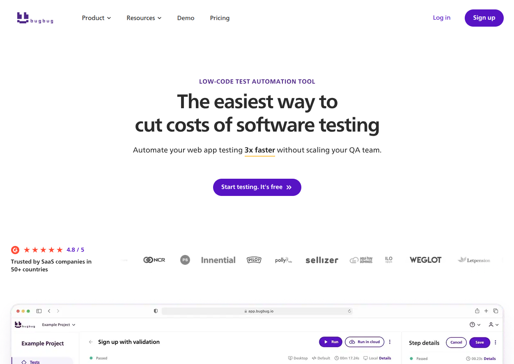
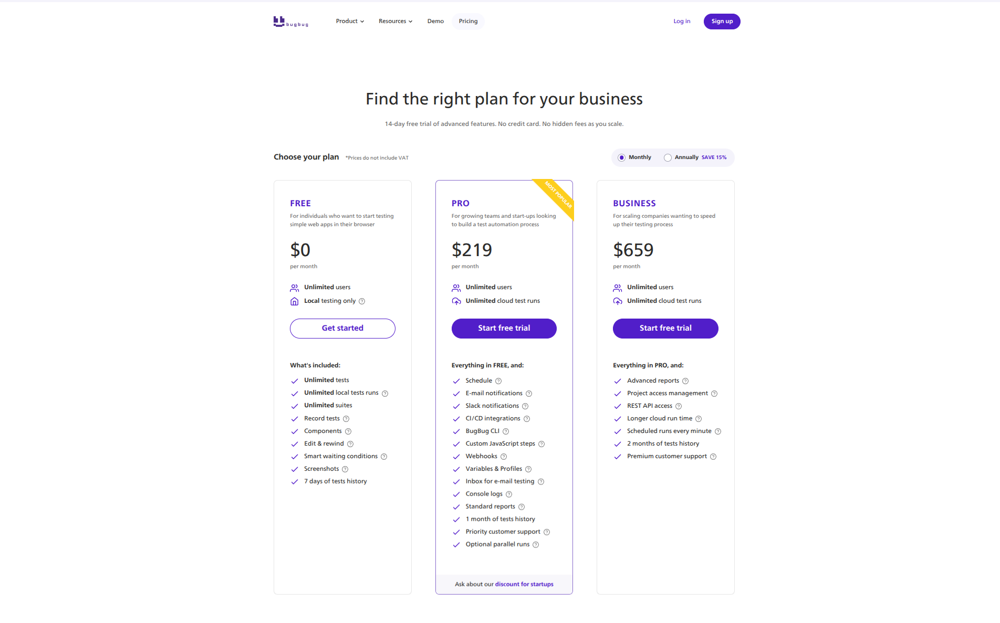

# Bugbug

Bugbug é uma ferramenta de automação de testes de ponta a ponta para aplicações web. Seu principal objetivo é simplificar a criação e manutenção de testes, mesmo para usuários sem conhecimento técnico em programação, através de uma interface de gravação e reprodução.

## Público-Alvo

A ferramenta atende a uma variedade de públicos:

- **Iniciantes e QAs Manuais:** Podem começar a automatizar testes rapidamente sem precisar escrever código.
- **Equipes em Crescimento:** Necessitam de integração contínua (CI/CD) e colaboração para escalar seus esforços de teste.
- **Grandes Empresas:** Buscam relatórios avançados, integrações e uma API para uma automação de testes mais robusta e personalizada.

## Funcionalidades Principais

- **Gravação de Testes:** Permite que os usuários gravem suas interações com um site para criar scripts de teste automaticamente.
- **Testes Locais e em Nuvem:** Oferece a flexibilidade de executar testes na máquina local (plano gratuito) ou em sua infraestrutura de nuvem (planos pagos).
- **Integração com CI/CD:** Facilita a incorporação dos testes automatizados em pipelines de desenvolvimento, como GitHub Actions ou Jenkins.
- **Notificações:** Integração com ferramentas como o Slack para notificar a equipe sobre os resultados dos testes.
- **API REST:** Disponível nos planos mais altos para permitir uma integração mais profunda com outros sistemas.
- **Histórico de Execução:** Mantém um registro dos resultados dos testes para análise e depuração.

[SUGESTÃO DE IMAGEM: Exemplo de um teste sendo gravado ou editado na interface do Bugbug.]

## Criação de Testes

<video controls src="https://github.com/KauanCalheiro/tcc/raw/refs/heads/main/Ferramentas%20Similares/BugBug/create-test.mp4" title="create-test.mp4"></video>

## Execução de Testes

## Preços

Bugbug oferece um modelo de assinatura com três níveis principais:

| Plano      | Preço    | Principais Características                                     |
|------------|----------|----------------------------------------------------------------|
| **Free**   | Gratuito | Ideal para iniciantes, com testes locais ilimitados e gravação.  |
| **Pro**    | $219/mês | Para equipes, adicionando testes em nuvem e integração CI/CD.    |
| **Business**| $659/mês | Para empresas, com relatórios avançados e acesso à API.        |

## Análise

Bugbug se destaca pela sua facilidade de uso, permitindo que equipes com diferentes níveis de habilidade técnica adotem a automação de testes. O modelo de preços escalável acompanha o crescimento da equipe e de suas necessidades. A principal limitação do plano gratuito é a execução de testes apenas localmente, o que pode ser um obstáculo para equipes que precisam de um ambiente de teste compartilhado e integrado ao CI/CD.

<!--
    Ponto fraco eh:
    1 - Plano free com execucao apenas local (sem nuvem)
    2 - Focado apenas em automacao via gravacao (sem IA, sem geracao de codigo)
    3 - Sem documentacao acompanhada dos testes gerados (ex: Gherkin .feature files)
 -->
