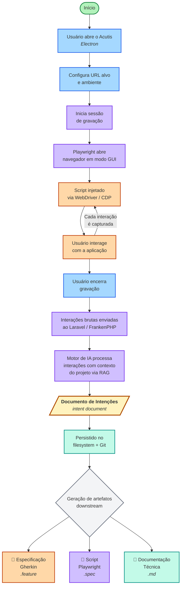

# Acutis: Hub Local-first de Testes Automatizados com Ênfase em Documentação

### 1. Visão do Produto

Uma plataforma desktop **open-source**, **local-first** e **colaborativa por design**, projetada para democratizar e acelerar a automação de testes, tendo a **documentação** como elemento central do processo.

A ferramenta atua como um orquestrador inteligente na máquina local, combinando gravação de interações via WebDriver, processamento assistido por IA e execução automatizada com Playwright. Utiliza o Git como fonte única de verdade para permitir versionamento, rastreabilidade, colaboração em equipe e integração com workflows de CI/CD já existentes.

O fluxo de trabalho produz, como representação intermediária, um **documento de intenções estruturado** (_intent document_) que captura o comportamento observado de forma agnóstica a frameworks. A partir desse formato, a plataforma pode gerar diferentes artefatos downstream — como especificações Gherkin, scripts Playwright ou documentação técnica — por meio de transformações dedicadas. Dessa forma, reduz-se a fragmentação entre requisito, implementação e validação, promovendo maior transparência, previsibilidade e alinhamento entre áreas técnicas e de negócio.

### 2. Os Problemas

A criação e manutenção de testes automatizados permanece como um desafio estrutural no desenvolvimento de software contemporâneo. O processo é frequentemente lento, suscetível a falhas e desalinhado dos requisitos de negócio. As soluções disponíveis no mercado, em sua maioria, impõem um trade-off entre acessibilidade técnica e privacidade de dados, ou entre custo e capacidade de integração ao ecossistema já existente.

Os problemas identificados não são isolados: eles se inter-relacionam e se retroalimentam, contribuindo para um ciclo de baixa maturidade em qualidade de software, aumento de risco operacional e elevação do custo de manutenção. A seguir, apresentam-se três macroproblemas interdependentes que estruturam essa análise.

---

#### 2.1 Barreiras Técnicas e Déficit de Documentação

A automação de testes demanda conhecimento especializado em frameworks, linguagens de programação, padrões arquiteturais (como Page Object Model) e técnicas de identificação e manipulação de elementos de interface. Para equipes que não dispõem de profissionais dedicados à automação, esse conjunto de pré-requisitos eleva significativamente o custo de entrada e dificulta a adoção sistemática de testes automatizados.

Como consequência, testes manuais repetitivos tendem a substituir a automação, resultando em ciclos de entrega mais longos, maior incidência de regressões e menor previsibilidade na evolução do sistema. O impacto organizacional manifesta-se na redução da confiança no software entregue e no aumento do retrabalho.

Esse cenário é particularmente crítico em sistemas legados, que frequentemente carecem de cobertura automatizada. A ausência de testes torna tais sistemas frágeis e de alto risco para modificação, dificultando iniciativas de modernização e ampliando o custo da manutenção evolutiva. Cada alteração passa a representar uma incerteza quanto à integridade do comportamento previamente implementado.

Paralelamente, a documentação técnica é, em muitos contextos, tratada como artefato secundário: produzida pontualmente e rapidamente desatualizada. A falta de sincronização entre documentação e código gera descontinuidade informacional, exige reconstrução constante de conhecimento sobre fluxos existentes e dificulta o onboarding de novos membros. Esse desalinhamento constitui um fator relevante de retrabalho e falhas de comunicação entre áreas técnicas e de negócio.

Nesse contexto, o desenvolvimento orientado por comportamento (_Behavior-Driven Development_ — BDD) oferece princípios relevantes ao aproximar linguagem de negócio e validação técnica (NORTH, 2006). Contudo, o acoplamento direto a formatos específicos — como a sintaxe Gherkin — pode restringir a flexibilidade do fluxo de automação e impor dependência de frameworks particulares. Uma abordagem alternativa consiste em capturar intenções de comportamento em um formato intermediário estruturado, a partir do qual diferentes artefatos — especificações executáveis, scripts de teste ou documentação técnica — possam ser gerados de forma desacoplada.

---

#### 2.2 Custo, Privacidade e Dependência de Plataformas SaaS

Grande parte das plataformas modernas de automação de testes adota o modelo Software as a Service (SaaS). Embora ofereçam facilidade inicial de uso, essas soluções impõem um dilema relevante: custos recorrentes potencialmente elevados ou a necessidade de tornar a aplicação sob teste acessível externamente.

Esse modelo pode implicar exposição, direta ou indireta, de sistemas internos, dados sensíveis e ambientes corporativos à infraestrutura de terceiros. Para organizações sujeitas a restrições orçamentárias, políticas rigorosas de segurança da informação, requisitos de compliance ou isolamento de rede, tal abordagem torna-se inviável ou incompatível com suas diretrizes institucionais.

A problemática se intensifica com a incorporação de inteligência artificial às ferramentas de automação. Muitas soluções baseadas em IA são proprietárias e fechadas, impondo o uso exclusivo do modelo de linguagem escolhido pelo fornecedor, sem possibilidade de substituição ou customização. Esse cenário limita a autonomia tecnológica das equipes e cria dependência estrutural de fornecedor (_vendor lock-in_).

Organizações que já realizaram investimentos em infraestrutura própria de IA, que necessitam utilizar modelos locais ou que estão sujeitas a requisitos regulatórios específicos quanto ao tratamento de dados não encontram alternativas compatíveis no ecossistema predominante. A obrigatoriedade de envio de código sensível e contexto de negócio a provedores externos eleva riscos relacionados à propriedade intelectual, confidencialidade e conformidade normativa.

---

#### 2.3 Integração Deficiente com Pipelines de CI/CD

A integração entre ferramentas de automação de testes e pipelines de integração e entrega contínua (CI/CD) constitui outro ponto crítico. Soluções baseadas em nuvem frequentemente oferecem integrações limitadas ou excessivamente complexas com ferramentas consolidadas, como Jenkins, GitLab CI e GitHub Actions.

Na prática, equipes acabam desenvolvendo scripts customizados e mecanismos de orquestração paralelos para viabilizar a execução de testes no pipeline. Essa fragmentação gera aumento da complexidade operacional, dificuldade de manutenção e redução da rastreabilidade das execuções.

Para organizações que já investiram na consolidação de sua infraestrutura de DevOps, a ausência de integração nativa representa um desalinhamento arquitetural que eleva o custo de adoção de novas ferramentas e compromete o retorno sobre investimentos previamente realizados. Além disso, soluções improvisadas tendem a comprometer a confiabilidade, a escalabilidade e a visibilidade do processo de garantia de qualidade.

---

Em conjunto, esses três macroproblemas evidenciam uma lacuna estrutural no ecossistema atual de automação de testes: a ausência de uma solução que concilie baixa barreira técnica, documentação sincronizada, execução local com preservação de privacidade, flexibilidade no uso de modelos de IA e integração nativa ao fluxo de entrega contínua. Em particular, nota-se a carência de uma representação intermediária que desacople a captura de intenções de comportamento dos formatos e frameworks utilizados para executá-las ou documentá-las. Essa lacuna fundamenta a motivação para a proposta apresentada neste trabalho.

---

### 3. Público-Alvo

A plataforma é direcionada a profissionais e equipes envolvidas no desenvolvimento, validação e gestão de software, especialmente em contextos que exigem automação de testes com documentação sincronizada, execução local e integração a pipelines de entrega contínua.

- **Quality Assurance (QA):**
  Profissionais responsáveis por validar o comportamento do sistema e estruturar estratégias de testes, manuais ou automatizados.

- **Desenvolvedores de Software:**
  Engenheiros que implementam funcionalidades e necessitam validar requisitos de forma contínua e integrada ao fluxo de desenvolvimento.

- **Gestores Técnicos (Tech Leads, Engineering Managers):**
  Responsáveis por qualidade, previsibilidade de entregas e definição de padrões técnicos dentro da equipe.

- **Analistas de Negócio / Produto:**
  Profissionais que especificam comportamentos esperados do sistema e necessitam rastreabilidade entre requisito e validação.

- **Equipes de DevOps / Infraestrutura:**
  Times responsáveis por pipelines de CI/CD, ambientes de execução e políticas de segurança.

---

### 4. Casos de Uso

A seguir, apresentam-se cenários específicos nos quais a plataforma agrega valor estratégico e operacional:

- **Adequação a Políticas de Privacidade e Proteção de Dados:**
  Execução integral dos testes em ambiente local ou em infraestrutura própria, evitando exposição de código-fonte, dados sensíveis ou ambientes internos a provedores externos.

- **Conformidade com Requisitos Regulatórios (Compliance):**
  Utilização da ferramenta em organizações sujeitas a normas internas ou externas que restringem o uso de SaaS, exigem rastreabilidade de alterações e controle sobre onde os dados são processados.

- **Ambientes com Isolamento de Rede (Air-gapped ou Rede Interna):**
  Execução da automação em ambientes sem acesso à internet ou com restrições severas de comunicação externa.

- **Auditoria e Rastreabilidade Técnica:**
  Versionamento de especificações de comportamento e artefatos de teste via Git, permitindo histórico claro de alterações, autoria e evolução comportamental do sistema.

- **Modernização Segura de Sistemas Legados:**
  Introdução incremental de testes de aceitação como camada de proteção antes de refatorações ou evoluções estruturais.

- **Documentação Sincronizada ao Comportamento Real:**
  Geração e manutenção de documentação viva derivada diretamente da execução dos testes, reduzindo inconsistências entre requisito, código e validação.

- **Integração Estruturada ao Pipeline de CI/CD:**
  Execução automatizada das suítes de teste como etapa obrigatória do fluxo de integração e entrega contínua.

- **Uso de Modelos de IA Locais ou Corporativos:**
  Integração com LLMs internos ou privados, garantindo autonomia tecnológica, controle sobre dados e redução de dependência de fornecedores externos.

---

### 5. Escopo Funcional Detalhado

#### Módulo A: Gestão de Projetos e Fluxos (Local & Git-based)

- **Arquitetura de Arquivos:** Leitura e escrita direta na estrutura de pastas do projeto local. Sincronização automática com Git para suportar múltiplos projetos e colaboração.
- **Gestão de Ambientes:** Configuração de variáveis (Dev, Homolog, Prod) salvas localmente em arquivos `.env`, com suporte a criptografia.
- **Mapeamento de Elementos:** Associação automática entre intenções de comportamento capturadas e elementos da interface da aplicação sob teste.
- **Organização:** Agrupamento lógico de documentos de intenções, suítes e tags (`@smoke`, `@critical`).

#### Módulo B: Motor de Geração Híbrida de IA

- **Estratégia Híbrida (Core Feature):**
  - _Modo Online:_ Conexão via API (OpenAI/Claude) para raciocínio complexo e geração de cenários criativos.
  - _Modo Offline:_ Uso de LLMs locais (via Ollama ou similar) para privacidade total e funcionamento sem internet.
- **Gerador Contextual de Intenções:** Criação de documentos de intenções e exemplos de comportamento baseada no contexto do projeto (via RAG/Vector Store).
- **Conversor Visual Inteligente:** Transforma gravações de interação via WebDriver em passos semânticos ("Login" vs "Click #btn-22"), gerando documentos de intenções estruturados.
- **Gerador de Artefatos Downstream:** A partir dos documentos de intenções, produz especificações BDD (Gherkin), scripts Playwright ou documentação técnica, de forma desacoplada e configurável.

#### Módulo C: Execução e Monitoramento

- **Execução Local:** Runner integrado baseado em Playwright, com execução server-side via Nuxt Nitro e streaming de resultados em tempo real (SSE). Suporte a modo headless ou GUI para debug visual.
- **Relatórios e Debug:** Dashboard em tempo real, logs estruturados e captura de vídeo/screenshot em falhas.
- **Análise de Flaky Tests:** Identificação estatística de testes intermitentes.
- **Self-Healing (Roadmap):** Em uma versão futura, a IA poderá analisar o DOM em caso de falha de seletor e sugerir a correção automaticamente.

#### Módulos de Suporte (D, E, F)

- **Gestão de Dados:** Fábrica de dados sintéticos e mascaramento de dados sensíveis.
- **Extensibilidade:** API de Plugins para integrações (Slack, CI/CD, TestRail).
- **Analytics:** Métricas de cobertura e ROI da automação (tempo economizado).

#### Fluxo Principal: Gravação e Geração de Artefatos

O diagrama a seguir ilustra o fluxo completo desde a gravação de uma interação pelo usuário até a geração dos artefatos downstream:

**Legenda de cores:**
🔵 Azul — Ação do usuário · 🟣 Roxo — Processamento Acutis · 🟠 Laranja — Navegador / WebDriver · 🟢 Verde — Persistência / Output · 🟡 Amarelo — Intent document (representação central)

---

### 6. Requisitos Técnicos e Arquitetura

**Arquitetura "Local-First" (Offline Capable)**

A arquitetura da plataforma é composta por três camadas de execução e uma camada lógica transversal, projetadas para operação integralmente local:

1.  **Desktop Shell (Electron):**
    - Camada fina de hospedagem que gerencia o ciclo de vida da aplicação e spawna os processos de backend. Não concentra lógica de negócio.
    - Integração com o sistema de arquivos do usuário para manipulação direta de projetos locais.

2.  **Server de Execução (Nuxt / Nitro):**
    - Responsável pela gravação de interações e execução de testes via Playwright, que controla o navegador por meio do protocolo WebDriver/CDP.
    - Transmite resultados em tempo real ao frontend por meio de Server-Sent Events (SSE).
    - Compilado como binário standalone para distribuição.

3.  **Backend de Processamento (Laravel / FrankenPHP):**
    - Gerencia operações de sistema de arquivos, integração Git, banco de dados SQLite, processamento de IA e geração de documentos de intenções.
    - Compilado como binário standalone via FrankenPHP para eliminação de dependências externas.
    - **Motor de IA (Camada de Abstração Lógica):** Interface para provedores plugáveis integrada ao backend, permitindo alternar entre LLMs locais (Ollama) para modo offline e APIs de nuvem (OpenAI, Anthropic) para modo online. Não constitui um processo separado, mas uma abstração que desacopla o restante do sistema do provedor de IA utilizado.

**Distribuição e CI/CD:**

- **Desktop:** Os binários do FrankenPHP (Laravel) e do Nuxt são empacotados dentro do Electron e distribuídos como instaladores nativos por plataforma. O usuário final não precisa instalar dependências manualmente.
- **CI/CD:** Os mesmos binários são executados de forma headless via Docker, sem necessidade do Electron, permitindo integração direta com pipelines existentes (GitHub Actions, GitLab CI, Jenkins).

**Armazenamento Local:**

- **SQLite:** Histórico de execuções, logs, configurações e metadados do projeto.
- **Vector Store Local (RAG):** Índice vetorial do código do projeto (via LanceDB ou ChromaDB) para fornecer contexto à geração assistida por IA.

---

### 7. Diferenciais Competitivos

1.  **Privacidade de Código:** Seu código nunca sai da sua máquina, a menos que você configure explicitamente uma IA de nuvem.
2.  **Sem Lock-in:** O formato intermediário (documento de intenções) é aberto e estruturado, e os artefatos gerados são arquivos em formatos abertos e padronizados que funcionam independentemente da ferramenta.
3.  **Performance:** Sem latência de rede para execução de testes ou para a interface do usuário.
4.  **Colaboração via Git:** A "verdade" do projeto reside nos arquivos versionados, facilitando Code Reviews e integração com workflows existentes.
5.  **Teste em Ambientes Restritos:** Suporta nativamente testes de aplicações em `localhost`, intranets ou atrás de firewalls corporativos, cenários impossíveis para a maioria das plataformas de nuvem.
6.  **Zero Configuração de Dependências:** A plataforma é distribuída como instalador nativo com todos os componentes compilados como binários standalone. O usuário final não precisa instalar runtimes, gerenciadores de pacotes ou serviços auxiliares.

---
